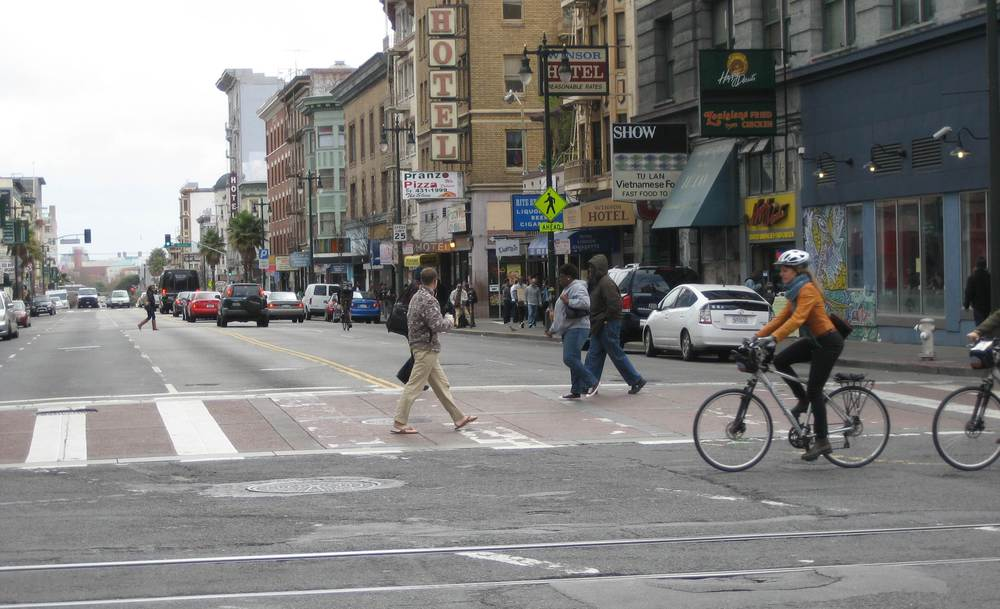

# Module-12 Object Detection with OpenCV & TensorFlow

---

  

---

A hands-on beginner-friendly project that demonstrates how to perform real-time object detection using **OpenCV's DNN module** and a **pre-trained TensorFlow model** (SSD MobileNet v2 on COCO dataset).

This notebook walks you through:
- Loading and parsing COCO class labels
- Reading model weights and configuration using TensorFlow's frozen graph
- Running object detection on an image
- Displaying predictions with bounding boxes and labels

---

##  Files Required

All files should be placed in the **same directory** as the notebook. Here's what you need:

- `coco_class_labels.txt` – COCO dataset class names
- `ssd_mobilenet_v2_coco_2018_03_29.pbtxt` – Configuration file for the model  
- `street.jpg` – Sample image to test detection (you can also use your own image)

###  Download Model Weights

You only need to download the model weights manually:

- `frozen_inference_graph.pb` – Pre-trained TensorFlow model weights  
  👉 [Download it here](https://github.com/TannerGilbert/Tensorflow-Object-Detection-API-train-custom-Mask-R-CNN-model/blob/master/frozen_inference_graph.pb)

Just drop this file in the same directory as your notebook and you're good to go.

##  Key Concepts Covered

- What is a DNN and why use `cv2.dnn`?
- How `blobFromImage` converts images for neural network processing
- Understanding outputs from the model (`classId`, `score`, bounding box coords)
- Tuning confidence thresholds for better detection accuracy
- Drawing labeled rectangles on detected objects

##  How to Use

1. Upload all required files
2. Run each code cell step-by-step
3. Customize detection thresholds or input images
4. Analyze the output — bounding boxes and labels will be shown inline

---

##  Model Used

- **Model**: SSD MobileNet v2  
- **Dataset**: COCO (Common Objects in Context)  
- **Framework**: TensorFlow + OpenCV DNN  
- [Model source (weights)](https://github.com/TannerGilbert/Tensorflow-Object-Detection-API-train-custom-Mask-R-CNN-model/blob/master/frozen_inference_graph.pb)

---

##  Beginner Tips

- The lower the threshold → the more sensitive the detection (may lead to false positives)
- You can swap out the model with any TensorFlow-supported architecture (as long as `.pb` and `.pbtxt` are provided)
- Make sure image color channels are handled properly (`BGR` vs `RGB`)

---

##  Navigation

&nbsp;&nbsp;&nbsp;&nbsp;

---

## Author
 

  Created and maintained by 
  <a href="https://github.com/aypy01" target="_blank">&nbsp Aaditya Yadav</a>&nbsp 
  

  

---

##  License

This project is licensed under the .

